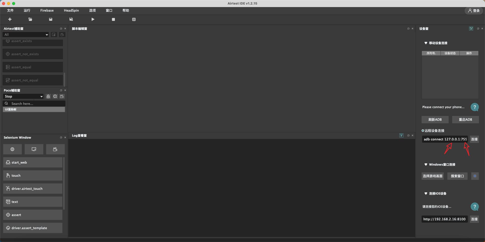
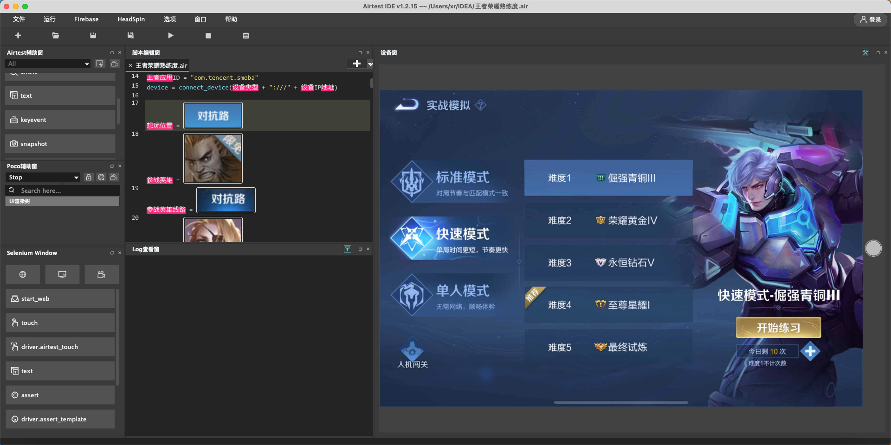
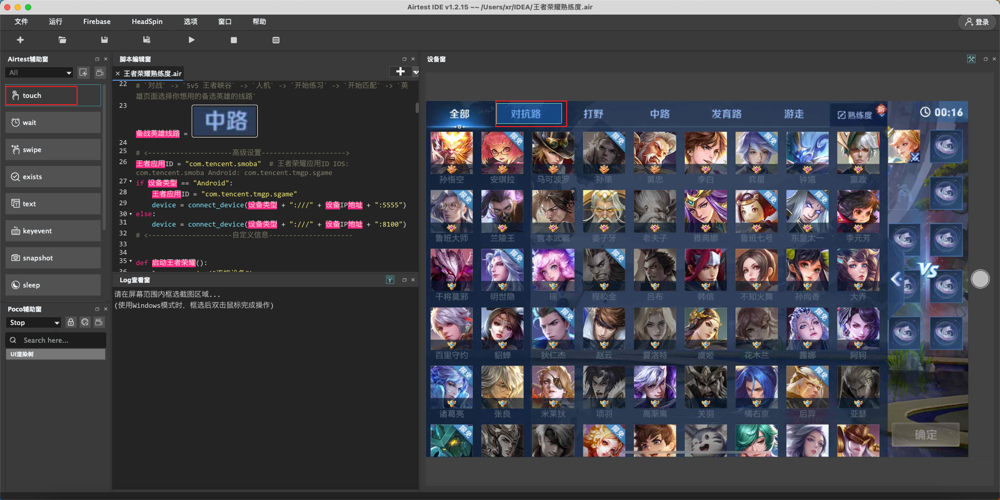

# 王者熟练度工具使用方法

## 安装初始化

1. 打开网页 https://airtest.netease.com/ 下载安装
2. 打开软件 软件最上面有一个 Options 点击 出现 `Language` 选择 `简体中文`
3. 打开软件 软件最上面有一个 `文件` 点击 `打开脚本`

## 连接手机

请使用 哔哩哔哩 搜索你的手机型号开启ADB

例如: vivo 开启 ADB

打开 `手机设置` -> `WiFi` -> 查看 WiFi IP地址信息，记住IP

这里输入你的IP和端口号，点击连接



这是连接成功的图片



打开王者，进入 `对战` -> `5v5 王者峡谷` -> `人机` -> `开始练习` 组队页面可以修改 想玩的线路

## 修改 

英雄: 夏侯惇

线路: 对抗路

首先打开软件 找到 自定义信息 

找到 参战英雄线路位置

换行输入：`想玩参战英雄线路 = ` 然后按一下 `touch` 再鼠标按住 选中 对抗路

接着把 `touch(` 删除 还有后面那个 `)` 也删除

其他的同理



## TIPS

同时启动 主账号和辅助账号 命令行启动

```bash
python3 王者荣耀熟练度.py
```

只有 `王者荣耀熟练度.py` 能在 `AirtestIDE` 中运行，其他文件会提示找不到库

王者荣耀 `动图` 太多，还需要多调试才能更完美

iOS-Tagent 安装很简单，最关键的就是 [参考文案](https://www.cnblogs.com/kaibindirver/p/16600353.html)